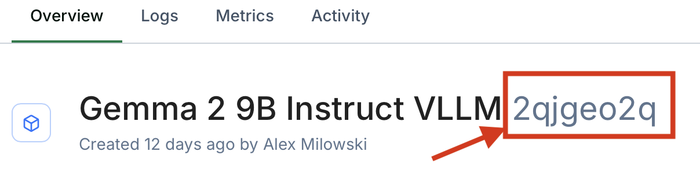

# Baseten plugin

Plugin for running against models hosted in [Baseten](https://www.baseten.co).

## Configuring endpoints

Currently, the systems available via baseten are controlled by and environment variable
`BASETEN_MODELS` that enumerates the models being hosted at baseten. This environment variable's
value is a list of comma separate name value pairs of SUT name and the baseten model id.

One way to locate this model identifier is to locate the deployment in your workspace,
click on the deployment's card in the workspace, and you'll see the model identifier 
as a suffix to the deployed model's name:



Baseten will host your model endpoint at a URL like:

```
https://model-{model_id}.api.baseten.co/production/predict
```

You then set the environment variable:

```bash
export BASETEN_MODELS="baseten-gemma2-9b=2qjgeo2q;prompt"
```

Then you can run the benchmark against your baseten endpoint:

```bash
python -m modelbench.run --plugin-dir plugins/baseten benchmark -s baseten-gemma2-9b
```

You can specify multiple models by separating them with a comma:

```
export BASETEN_MODELS="baseten-gemma2-9b=2qjgeo2q;prompt,baseten-llama3.1-8b=2qjgex2q;messages"
```

The value for each SUT specified is the model identifier follow by semicolon separated parameters. Currently,
the only parameter is the type of interface used by the endpoint:

* `prompt` - a basic prompt interface (e.g., like Gemma 2) 
* `messages` - a "chat messages" interface (e.g., like llama 3.1). 

If you do not specify the interface type, it will default to `messages`.